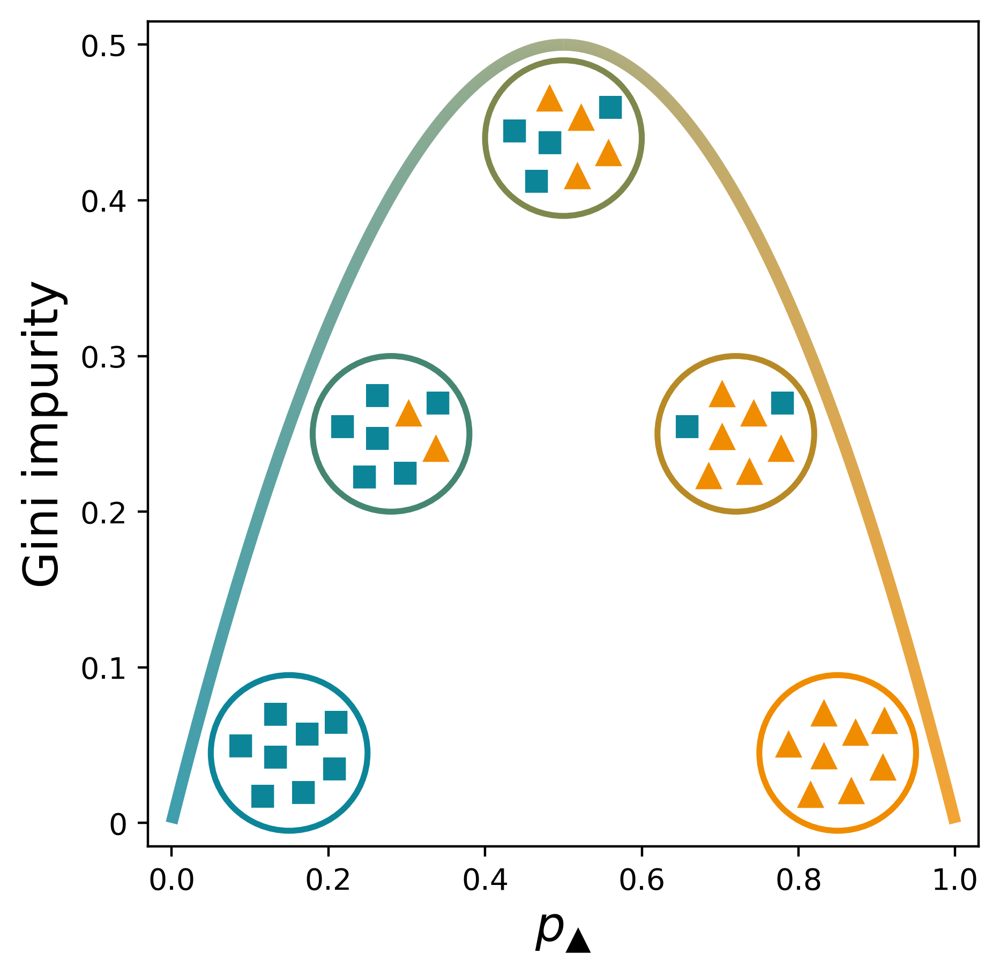

# Color transition
This code generates a figure that shows the Gini impurity as a function of $p_k$, the probability of randomly selecting an element belonging to the $k$ class (a triangle here). The colors transition from one class to the other as a function of the impurity.

